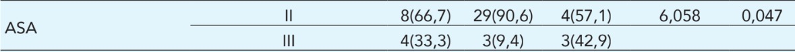
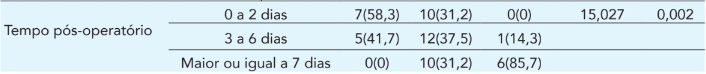
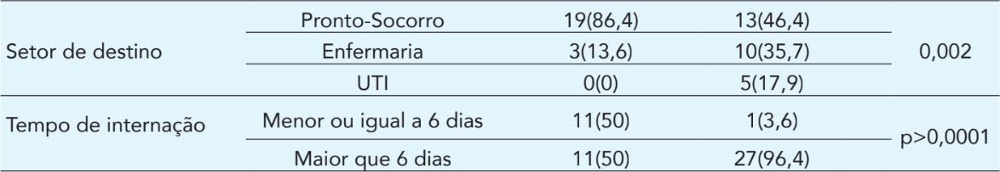

# Introdução
## 
::: box-purple
**Motivação:**
:::
:::box-purple
- Envelhecimento populacional acelerado 
- Alta vulnerabilidade a acidentes e quedas 
- Melhoria da assistência e do planejamento cirúrgico
:::

::: box-purple
**Objetivo:**
Identificar as principais complicações pós-operatórias e o desfecho clínico de idosos submetidos à cirurgia de correção de fratura.
:::

::: box-purple
**Data e Local de Pesquisa:**
Agosto a Outubro de 2021 - Uberlândia, Minas Gerais
:::

::: box-purple
**Público-Alvo:** 
Idosos com idade igual ou superior a 60 anos.
:::

## Como foi realizado o questionário:

O questionário foi dividido quanto aos dados sociodemográficos, clínicos, complicações pós-operatórias e desfechos.

**Os dados foram obtidos:**

::: box-blue
1. Entrevista por meio de um questionário estruturado e adaptado para o estudo
2. Análise documental das informações contidas no prontuário eletrônico.
:::

# Metodologia Estatística

## Variáveis Analisadas

::: box-blue
1.  **Variáveis Analisadas:**
- Tipo de fratura
- Classificação ASA (Risco Cirúrgico)
- Tempo de internação pré e pós-operatório
- Quantidade de complicações pós-operatórias
- Setor de destino pós-cirúrgico
- Desfecho clínico final
:::

::: box-purple
2.  **Desfechos:**

- Quantidade de complicações pós-operatórias (categorizadas em 0, 1 a 2, 3 ou mais)
- Setor de destino pós-cirúrgico (Pronto-Socorro, Enfermaria ou UTI)
- Desfecho clínico final (Alta ou Óbito)
:::

## Aplicação e Apresentação dos Testes de Associação

Para avaliar a independência entre os grupos e as variáveis qualitativas, os autores utilizaram:

::: box-red
**Teste Qui-Quadrado de Independência:** quando as frequências esperadas eram maiores que cinco.

**Teste Exato de Fisher:** quando pelo menos uma das frequências esperadas eram menores que cinco.
:::

::: box-grey
- Foi aplicada a correção de continuidade nas tabelas de contingência 2x2 para o Teste Qui-Quadrado, e o nível de significância adotado para todas as análises foi de 5% (p \< 0.05)
:::

# Tabelas com as associações significativas encontradas:
##
**Tabela de Quantidade de Complicações vs. Fatores Clínicos**
{style="width: 85%; margin-bottom: 1px; display: block;"}
{style="width: 85%; margin-bottom: 1px; display: block;"}
{style="width: 85%; margin-bottom: 1px; display: block;"}
{style="width: 85%; margin-bottom: 1px; display: block;"}

**Interpretação**

| Associação                    | O que encontramos?                                |
| ----------------------------- | ------------------------------------------------- |
| Complicações × desfecho       | 3+ complicações → 28,6% de óbito                  |
| Complicações × ASA            | Associação com classificação ASA                  |
| Complicações × pós-operatório | 85,7% do grupo 3+ → ≥7 dias                       |

##
**Tabela de Tipo de Fratura vs. Variáveis Intra-hospitalares:**
{style="width: 110%; margin-bottom: 1px; display: block;"}
{style="width: 110%; margin-bottom: 1px; display: block;"}

**Interpretação**

| Associação                    | O que encontramos?                                |
| ----------------------------- | ------------------------------------------------- |
| Fratura × setor               | Todos os pacientes da UTI tinham fratura inferior |
| Fratura × internação          | 96,4% das fraturas inferiores → >6 dias           |

# Conclusão

## Implicações Práticas e Recomendações

::: box-purple
**Assistência e Gestão Hospitalar:**
:::
::: box-purple
- **Planejamento cirúrgico precoce:** Reduzir o tempo de espera pré-operatório, contribuindo para menor tempo de internação e redução de desfechos desfavoráveis.
- **Vigilância Intensiva:** Atenção redobrada aos pacientes com fraturas de membros inferiores e maior risco cirúrgico (ASA), devido à associação observada com complicações pós-operatórias.
:::

::: box-blue
**Saúde Pública:**
:::
::: box-blue
- Necessidade de ações educativas e de atenção básica voltadas à prevenção de quedas, que representaram 66% dos mecanismos de fratura observados.
:::

##
::: box-blue
**Limitações e Perspectivas:**
:::
::: box-blue
- **Limitações do Estudo:** Amostra pequena (n=51) e perda amostral significativa, principalmente pela indicação de tratamento conservador.
- **Saúde Coletiva:** Necessidade urgente de ações educativas e de atenção básica voltadas à prevenção de quedas da própria altura (responsáveis por 66% dos casos).
:::
